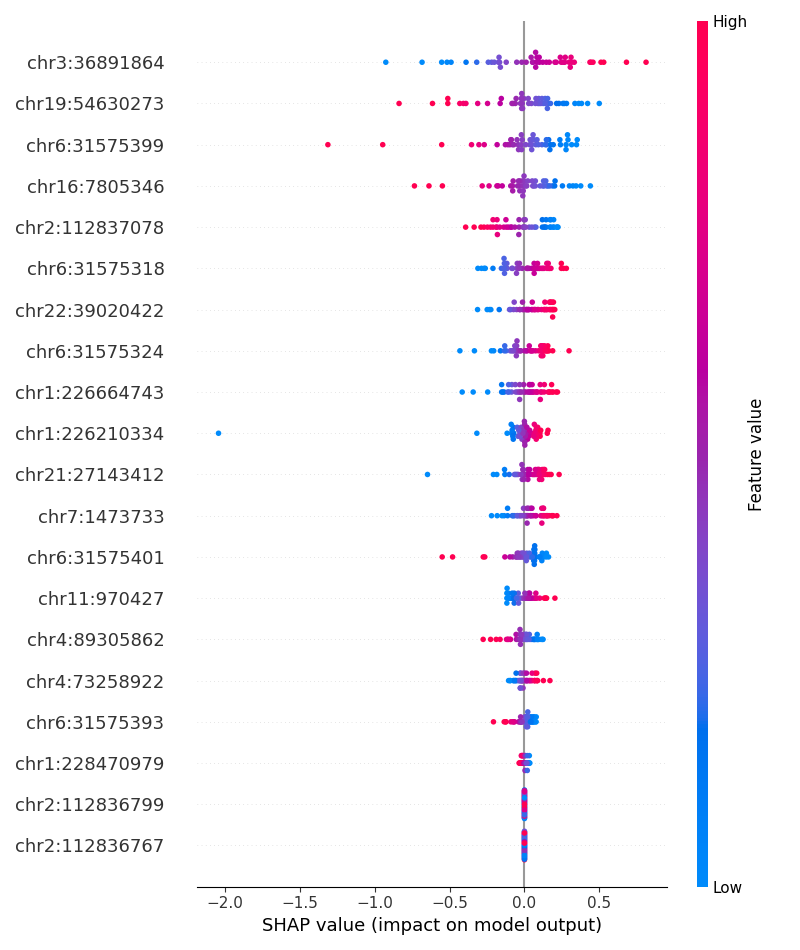

# Pneumonia Epigenetic Clock

A machine learning classifier built on CpG methylation data to predict pneumonia presence and time since onset using Elastic Net regression.

##  Problem
Pneumonia lacks early, accurate diagnostic tools. DNA methylation offers a powerful avenue for non-invasive prediction.

##  Data
- DNA methylation beta values from 126 patients (pneumonia vs. control)
- ~250 CpG sites selected using RFE, SHAP, and biological relevance
- Annotated using UCSC Genome Browser and GREAT

##  Methods
- Preprocessing: StandardScaler, SMOTE for class balancing
- Modeling: Logistic Regression, Random Forest, Elastic Net
- Feature expansion + dimensionality reduction using:
  - Recursive Feature Elimination (RFE)
  - SHAP values
  - Domain-informed gene/CpG annotation

##  Results
- **Elastic Net** model achieved:
  - Accuracy: 98%
  - Precision: 98%
  - Recall: 98%
  - F1-score: 98%
- Biomarkers enriched for immune & pulmonary pathways (e.g., **C1QB, SMAD9, LILRB4, EPHB2**)

##  Future Work
- External cohort validation
- Prototype clinical dashboard
- Add time-dependent infection classification

##  Skills & Tools
`Python`, `pandas`, `scikit-learn`, `matplotlib`, `SHAP`, `RFE`, `GREAT`, `UCSC Genome Browser`

---

## License
MIT
